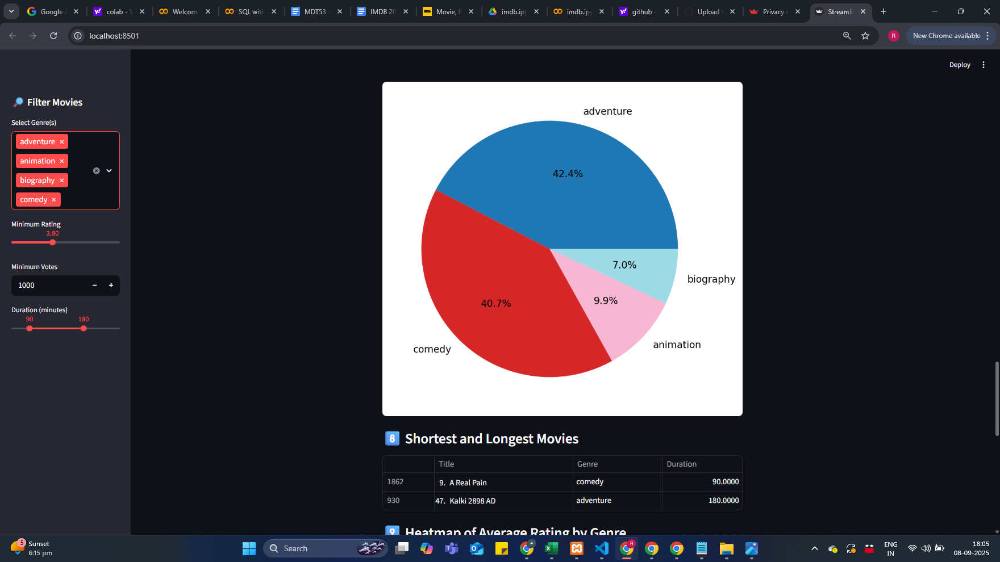
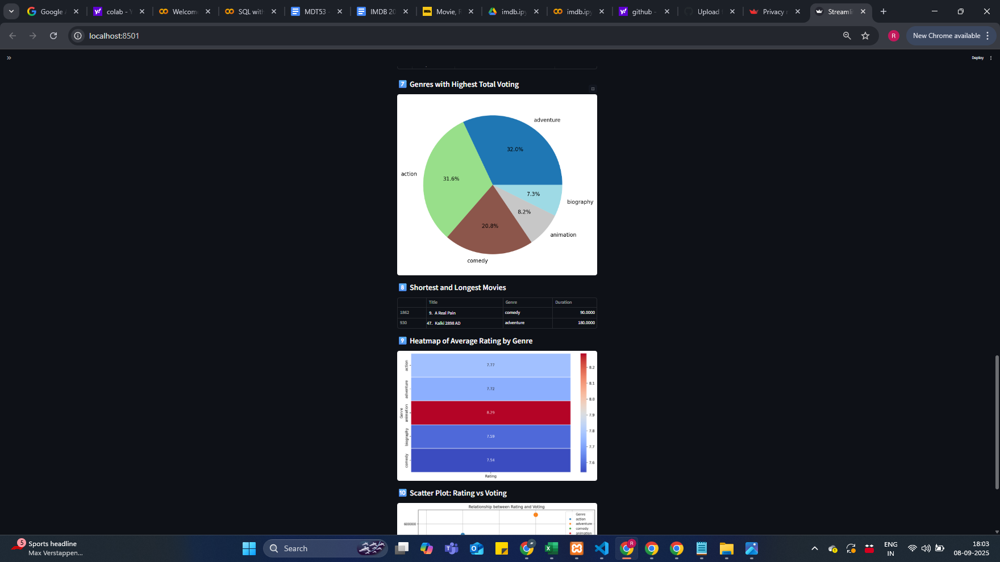

# IMDB 2024 Movie Explorer — Selenium Scraping + Streamlit
Discover IMDB titles with an automated data pipeline and an interactive Streamlit interface for filtering and charts.

## What this project does
Builds a compact movie knowledge base by collecting pages from IMDB, organizing them into Pandas DataFrames, and surfacing insights through a simple web app.

## Domain focus
Entertainment analytics and discovery.

## Skills learned
Python automation, Selenium scraping, SQL data storage, and Streamlit dashboarding.

## Tools and versions
- **Python** for scripting and data prep.
- **Selenium WebDriver** for dynamic page extraction.
- **Streamlit** for the UI and visualizations.
- **MySQL** (optional) for durable storage and queries.

## Core capabilities

### Collect IMDB data (Selenium)
Automates a browser session to load JavaScript-driven pages, search, follow links, and read elements reliably for each title.

### Persist and query (MySQL, optional)
Converts raw results into tidy DataFrames, then writes them into MySQL tables using a connector/ORM for consistent schemas and easy analysis.

### Interact and visualize (Streamlit)
Offers filter controls for Genre, Rating, Vote count, and Duration; tables and plots update instantly to support quick exploration.

## Libraries used
- selenium, webdriver-manager
  from selenium import webdriver
  from selenium.webdriver.common.by import By
  from selenium.webdriver.common.action_chains import ActionChains
  from selenium.webdriver.common.keys import Keys
  import time
- mysql-connector-python
- pandas, numpy, seaborn, matplotlib/plotly
- SQLAlchemy
- streamlit

## Screenshots

### 1. Home Page

### 2. Filtering Example

### 3. Visualization Example

